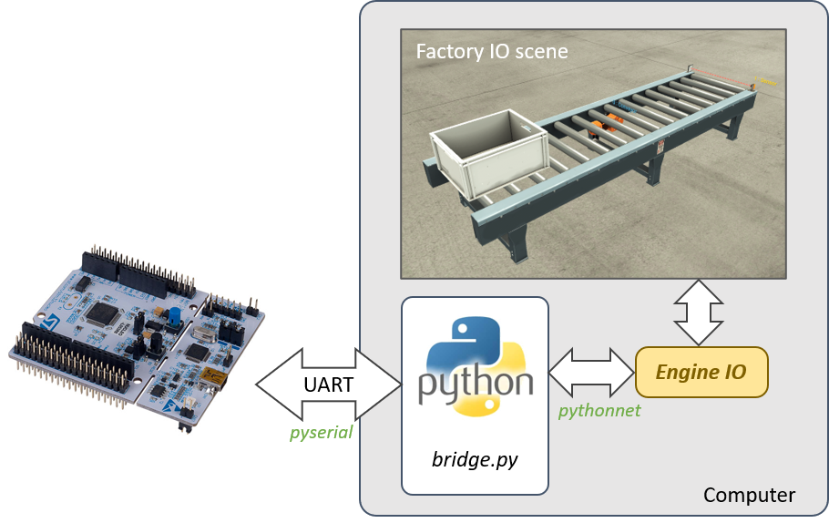

# Bridge FactoryIO

Ce projet contient les éléments nécessaires pour mettre en place le TP OSTR (MEA4/SE4).

## Getting Started

Afin de vous assurer que vous avez bien installé tous les éléments nécessaires pour faire fonctionner ce projet, suivez le [tutoriel Moodle](https://moodle.umontpellier.fr/mod/page/view.php?id=351387).

## Architecture du projet

Ce projet permet de faire le lien entre la communication série avec une carte STM32 et le logiciel FactoryIO (grâce au SDK EngineIO).

Voici l'architecture du projet :

## Documentation Communication Série

La liaison série entre le port COM de votre ordinateur et la carte STM32 est paramétrée à `115200bauds` par défaut. La communication série est encadrée par un format de trame de 8 octets qui est le suivant:

- SOF (1byte):
  - `0xA3`: Force Update States
  - `0xA8`: Sensors States
  - `0xAD`: Actuators States
- Data Bytes (4 bytes)
  - Le MSB de chaque octet doit rester à 0 (Réservé)
  - Les LSB restants correspondent aux états des capteurs (ou actionneurs) à l'adresse correspondante
    - Data1: Adresses de 0 à 6 (LSB to MSB)
    - Data2: Adresses de 7 à 13 (LSB to MSB)
    - Data3: Adresses de 14 à 20 (LSB to MSB)
    - Data4: Adresses de 21 à 27 (LSB to MSB)
- CRC (1 byte)
  - Les 5 MSB doivent correspondre au nombre de `1` présents dans les octets de data. Par exemple, si les data sont composées de cinq fois la valuer `1`, l'octet CRC sera le suivant: `0b00101000`.
  - Les 3 LSB restants doivent rester à 0 (Réservé)
- Line Feed (`\n`)